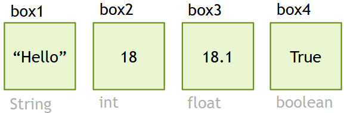
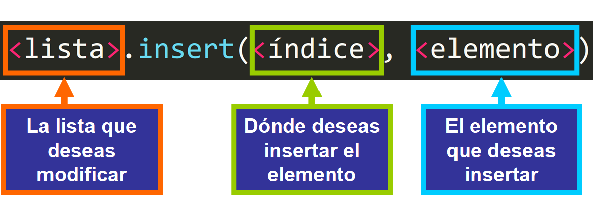
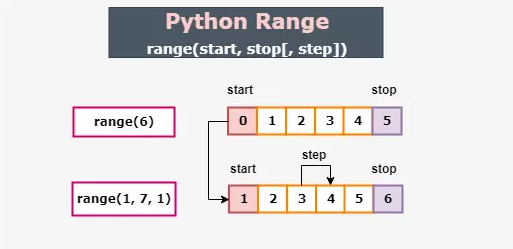

# Types of variables, list, tuple and range

## Table of Contents
- [Types of variables](#types-of-variables)
- [List](#list)
- [List Methods](#list-methods)
- [Tuple](#tuple)
- [Range](#range)

---

## Types of variables
### Description
A variable is a space in a storage system that receives an **identifier** and holds information that is either known or unknown. In other words, a variable can be seen as a box where we store and exchange data of specific types.


### Variable Declaration
In Python, when declaring a variable, we do not need to specify the type of data we are going to store in it, unlike in other programming languages.
#### Examples:
```python
box1 = "Hello"
box2 = 18
box3 = 18.1
box4 = True
```


As we see in the code, first the name of the variable is written, followed by the operator `=` (which in these cases is an assignment operator, not an equals sign), and then the data that it will store. Depending on the data we store in it, Python will determine the type of the variable.

### Syntax
**If the data to be stored is an `string`, remember that it must be enclosed in quotation marks!**

You should always first indicate the name of the variable and then its content, like this:
```python
num = 17
```
Variable names are sequences of letters and numbers, either uppercase or lowercase, but **always starting with a letter**. A variable should **never contain spaces**; to separate words, we can use an underscore `_`.

### Types of variables
There are 3 most common types of variables:

- **Numeric:** Store numbers; within this category, we can find subtypes such as `int`, `float`, `long`, and `complex`.
- **Text:** These are the classic variables that store strings of text as `string` and `char`.
- **Boolean:** Store a value of True or False as `bool`.

But in Python, variables can also be *lists*, *dictionaries*, *tuples* (which we will cover later). Almost anything can be stored in them.

### `type()` function
You can determine the type of a variable using the built-in type() function, which allows you to know the type of a variable at a specific moment.
To call the type() function, simply write the function in the interpreter and pass the name of the variable as a parameter within the parentheses, like this:
```python
box1 = "Hello"
type(box1)
```
**Console:**
```console
<class 'str'>
```
When you run the program, it will return the type of the variable.
```python
box1 = "Hello"
box2 = 18
box3 = 18.1
box4 = True

print(type(box1))
print(type(box2))
print(type(box3))
print(type(box4))
```
**Console:**
```console
<class 'str'>
<class 'int'>
<class 'float'>
<class 'bool'>
```
---
## List
We can define a list as a contiguous storage area where we can store multiple and different types of data. **It can be edited and modified** using methods, making it mutable.

To create a list, we simply declare it as we would a variable, but by storing its elements or items within **square brackets**:
```python
# List of numbers
numbers = [1,2,3,4,5,6,7,8,9]
#List of boolean
responses = [False, True, True, False, False]
#List of mixed values
data = ["Close", 53, 78.102, "Batoi", False]
```

Lists can also be created without specifying the elements they contain, as they are mutable and we can add elements later.

**Lists can also contain other lists**
```python
#List inside other list
data = ["Close", 53, [45, "Python", True], "Batoi", False]
```

### Accessing List Elements
To access the elements, we must consider that each element stored in a list is assigned an `index`.

An index is a number that identifies the element within the group of elements or items, **always starting from zero**.

Even if we modify the elements, the first one will always be zero, and the indices will increment from there.
```python
# Index   0     1    2      3      4
items = ["Hi", 54, False, 37.21, "Table"]
```

So, if I simply want to access the number 37.21 from the list *items*, I must specify **the list followed by the index number in square brackets** that corresponds to it:
```python
# Index   0     1    2      3      4
items = ["Hi", 54, False, 37.21, "Table"]
print(items[3])
```
**Console:**
```console
37.21
```

To access an element in a list that is inside another list, you first need to specify the index of the outer list and then the index of the inner list. In the example, the list `[45, "Python", True]` has index **2** in the outer list, and within this list, the number 45 has index **0**.
```python
# Index    0      1          2                3      4
# Index                0     1        2
data = ["Close", 53, [45, "Python", True], "Batoi", False]
print(data[2][0])
```
**Console:**
```console
45
```
---

## List Methods

### The `append()` method
It is used to **add an element to the end of a list**. It is very simple to use: you just write the name of the list you want to modify, followed by a dot, the method (append in this case), and then the element to add inside parentheses.


#### Example:
```python
names1 = ["Marcos", "Roberto", "Elena", "Margarita"]
print(names1)
names1.append("Alex")
print(names1)
```
**Console:**
```console
["Marcos", "Roberto", "Elena", "Margarita"]
["Marcos", "Roberto", "Elena", "Margarita", "Alex"]
```

### The `extend()` method
It is useful for **adding multiple elements** from an iterable to **the end of a list** or for appending another list in Python. The `extend()` method allows us to extend the list.

#### Example 1:
```python
names1 = ["Marcos", "Roberto", "Elena", "Margarita"]
print(names1)
names1.extend("Jose")
print(names1)
```
**Console:**
```console
["Marcos", "Roberto", "Elena", "Margarita"]
["Marcos", "Roberto", "Elena", "Margarita", "J","o","s","e"]
```

#### Example 2:
```python
mylist = [1, 2, 3, 4]
mylist.extend([5, 6, 7])
print(mylist)
```
**Console:**
```console
[1, 2, 3, 4, 5, 6, 7]
```
### The `insert()` method
What if I want to add an element somewhere other than at the end of the list?

To insert an element at a specific position, we can use the `insert()` method in the same way as before. First, specify the name of the list, followed by a dot and the method (insert in this case). Then, **inside parentheses, provide the index where you want to insert the element, followed by a comma and the element itself**.



#### Example:
```python
items = ["Chair", "Table", "Dish", "Glass"]
print(items)
items.insert(2, "Fork")
print(items)
```
**Console:**
```console
["Chair", "Table", "Dish", "Glass"]
["Chair", "Table", "Fork", "Dish", "Glass"]
```
### The `pop()` method
It is used to **remove an element from the list by specifying the index** of the element. Like the other methods, you only need to enter the list's name, followed by a dot and the method name (`pop()` in this case). Then, inside the parentheses, specify the index of the element to remove.

#### Example:
```python
items = [3.5, 113, "Table", 87.3, 654]
print(items)
items.pop(2)
print(items)
```
**Console:**
```console
[3.5, 113, "Table", 87.3, 654]
[3.5, 113, 87.3, 654]
```
In this case, it removes 'Table', which is at index 2 as specified within the parentheses. **If you do not provide an index to the pop method, it will remove the last element from the list.**

When there is a list inside another and we want to delete an element from the inner list, **we must first indicate the index of the internal table in the external one**, in the example the internal list is at index 3 of the external list. Then **apply the method and indicate the index of the element you want to delete**, in the example below the string "House" has index 2.

#### Example 2:
```python
#Index    0      1      2               3             4
#Index                        0     1      2     3
items = [True, "Yes", 4.23, [0.48,False,"House",47], 654]
print(items)
items[3].pop(2)
print(items)
```
**Console:**
```console
[True, "Yes", 4.23, [0.48,False,"House",47], 654]
[True, "Yes", 4.23, [0.48,False,47], 654]
```

### The `remove()` method
This method can also be used to remove an element from the list. The `remove()` method allows us to remove an element from a list in Python by **specifying its value**.

#### Example 1:
```python
items = [3.5, 113, "Table", 87.3, 654]
print(items)
items.remove("Table")
print(items)
```
**Console:**
```console
[3.5, 113, "Table", 87.3, 654]
[3.5, 113, 87.3, 654]
```
When there is a list inside another and we want to delete an element from the inner list, **we must first indicate the index of the internal table in the external one**, in the example the internal list is at index 3 of the external list. Then apply the method and indicate the element you want to delete, in the example below it is 0.48.

#### Example 2:
```python
#Index    0      1      2               3             4
#Index                        0     1      2     3
items = [True, "Yes", 4.23, [0.48,False,"House",47], 654]
print(items)
items[3].remove(0.48)
print(items)
```
**Console:**
```console
[True, "Yes", 4.23, [0.48,False,"House",47], 654]
[True, "Yes", 4.23, [False,"House",47], 654]
```

### The `sort()` method
The `sort()` method will help us to **order the elements of a list** from smallest to largest.

#### Example 1:
```python
grades = [7.8,5.3,3.2,9.9,6.6,2.5]
grades.sort()
print(grades)
```
**Console:**
```console
[2.5, 3.2, 5.3, 6.6, 7.8, 9.9]
```

If we want the sort method to order the elements **from largest to smallest**, we must enter the argument `reverse=True`.

#### Example 2:
```python
grades = [7.8,5.3,3.2,9.9,6.6,2.5]
grades.sort(reverse=True)
print(grades)
```
**Console:**
```console
[9.9, 7.8, 6.6, 5.3, 3.2, 2.5]
```
### The `reverse()` method
The `reverse()` method will help us **reverse all the elements of a list**, as if we were seeing them through a mirror.

#### Example:
```python
letters = ["i","o","t","a","B"]
letters.reverse()
print(letters)
```
**Console:**
```console
["B", "a", "t", "o", "i"]
```

### The `split()` method
The `split()` method is used with `string`, not with `list`. It divides a string into smaller parts using a specific character or sequence of characters as the delimiter and returns those parts in a list.
#### Syntax
```python
string.split(separator)
```
- **string:** The string you want to divide.
- **separator:** The character or sequence of characters used as the delimiter.

#### Example 1:
```python
text = "Hello, how are you?"
text_divided = text.split(",")
print(text_divided)
```
**Console:**
```console
["Hello","how are you?"]
```

#### Example 2:
***Note:*** By default, if no separator is specified, the string is split by whitespace.
```python
text = "Hello, how are you?"
text_divided = text.split()
print(text_divided)
```
**Console:**
```console
["Hello,","how","are","you?"]
```
---
## Tuple
A tuple is similar to a list in that it is a contiguous storage area where we can store multiple and different elements. However, there are some distinct similarities and differences that you should always remember.

Tuples are variables where different types of structured data are stored and must be ordered from the beginning.

**Tuples are immutable**; they **cannot be modified** during the execution of the program. Therefore, when creating a tuple, you must include the elements to be stored. Whenever we create a tuple, ***we must use PARENTHESES***.
```python
# Tuple of numbers
numbers = (1, 579.24, 3.6, 4, 5, 6, 7)
#Tuple of boolean
responses = (False, True, True, False, False)
#List of mixed values
data = ("Close", 53, 78.102, "Batoi", False)
```
### Accessing Tuple Elements
To access the elements, we must consider that each element stored in a tuple is assigned an `index`.

An index is a number that identifies the element within the group of elements or items, **always starting from zero**.

Even if we modify the elements, the first one will always be zero, and the indices will increment from there.
```python
# Index   0     1     2      3      4
items = (183, True, "ABC", 59.20, "End")
```

To access the values of a tuple, it is done exactly the same way as in a list, using **square brackets** ***(NOT PARENTHESES)***.So, if I simply want to access the string "ABC" from the tuple *items*, I must specify **the tuple followed by the index number in square brackets** that corresponds to it:
```python
# Index   0     1     2      3      4
items = (183, True, "ABC", 59.20, "End")
print(items[2])
```
**Console:**
```console
ABC
```
---
## Difference Between Lists and Tuples
| List      | Tuple      |
|---------------|---------------|
| Can be modified, are dynamic  | Cannot be modified, are static |
| Use square brackets `[]`  | Use parentheses `()` |
| Elements are separated by commas   | Elements are separated by commas |
| list = [1, 2, 3]| tuple = (1, 2, 3)   |
| Accessing elements: list[index] | Accessing elements: tuple[index] |

---
## Range
Creates a range of values as specified by your arguments. Specify **where to start** selecting, **where to end**, and the **intervals**.
It cannot be modified except at the time of creation, or after instructing the interpreter to store it in a variable.



If you run, for example, `range(5)`, you won’t notice anything happening, but something did happen: a sequence of numbers as you specified is stored in memory. However, it is still invisible because it doesn’t exist as an object you can see. To be able to view it, we must first convert it into a list. To do this, we use the `list()` function.
#### Example 1:
```python
x = list(range(5))
print(x)
```
**Console:**
```console
[0,1,2,3,4]
```

#### Example 2:
Let's create a range that stores in a list all even values between 2 and 20:
```python
x = list(range(2,20,2))
print(x)
```
**Console:**
```console
[2, 4, 6, 8, 10, 12, 14, 16, 18]
```