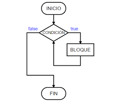

# For and While Loops

## Table of Contents
- [Loops in Python](#loops-in-python)
- [`for` Loop](#for-loop)
- [`while` Loop](#while-loop)
- [Loop Control: `break`, `continue`, and `pass`](#loop-control)
- [Differences between `for` and `while`](#differences-for-and-while)

---

## Loops in Python

A loop in programming **is the continuous execution of a specific block of code while a designated condition is met**.
For example, a loop is a part of our program that executes continuously **while a certain condition is fulfilled**.



---

## `for` Loop

- The `for` loop is responsible for **iterating over a sequence**, looking for elements that meet a certain condition, and performing some instruction as specified. It's important to note that these elements must be **iterable**, meaning they **can be traversed**.

- In the case of a `for` loop, you must specify the variable where the items of the iterable element (`list`, `dictionary`, `string`, etc.) **will be stored**. 

- The `for` statement **is followed by the variable where the items will be stored**, then after **the `in` operator** and **the element to iterate over**.

```python
numbers = [1, 2, 3, 4, 5, 6, 7, 8, 9]  # Create the list with numbers

for num in numbers:  # Store the list items in the variable "num"
    if num % 2 == 0:  # Condition: If the remainder of the division by two is zero, then:
        print(num)  # Print the variable num
```
**Console:**
```console
2
4
6
8
```

## `while` Loop
- The `while` loop allows us to **execute a block of code continuously *while the condition is true***, and we can even create infinite loops.

- These loops execute while the condition is true; if the condition is met, the body of the loop executes, and then the condition is checked again. If it remains true, the loop executes again. If it’s not met, the loop is skipped, and the program continues normally.

```python
i = 0  # Declare the value of the variable "i"

while i <= 9:  # Create the loop with the condition to execute while "i" is less than or equal to "9"
    i += 1  # Increment i by one (i is equal to i plus one)
    print(i)  # Print "i"
```
**Console:**
```console
1
2
3
4
5
6
7
8
9
10
```

## Loop Control: `break`, `continue`, and `pass`
Sometimes we might not want a loop to continue indefinitely once it has served its purpose. For this, we have loop control using these three instructions: `break`, `continue`, and `pass`.

### `break`
This instruction is used to **terminate a loop**, that is, exit it and continue with the execution of the remaining instructions of the program.

```python
string = "Python"

for letter in string:
    if letter == "h":
        print("Found the 'h'")
        break
    print(letter)
```
**Console:**
```console
P
y
t
Found the 'h'
```
```python
x = 5

while True:
    x -= 1
    print(x)
    if x == 0:
        break
print("End of the loop")

```
**Console:**
```console
4
3
2
1
0
End of the loop
```
### `continue`
The `continue` instruction within a loop **forces the interpreter to return to the beginning of the loop**, skipping all the instructions or iterations below it.

```python
string = "Python"

for letter in string:
    if letter == "P":
        continue
    print(letter)
```
**Console:**
```console
y
t
h
o
n
```
```python
x = 5

while x > 0:
    x -= 1
    if x == 3:
        continue
    print(x)
```
**Console:**
```console
4
2
1
0
```

### `pass`
The `pass` instruction **is a null statement; it does nothing**. It is almost like it doesn’t exist but allows us to create a loop without placing code in its body, to be added later, using it as a temporary placeholder.

The difference with continue is that continue ends the current iteration but continues with the next instruction or iteration of the loop, returning to the beginning. In contrast, pass does nothing and continues with the next instructions of the loop without returning to the beginning.

```python
for letter in "Python":
    if letter == "h":
        pass
    print("Current letter:", letter)
```
**Console:**
```console
Current letter: P
Current letter: y
Current letter: t
Current letter: h
Current letter: o
Current letter: n
```
```python
var = 10

while var > 0:
    var -= 1
    if var == 5:
        pass
    print("Current value of the variable:", var)
```
**Console:**
```console
Current value of the variable: 9
Current value of the variable: 8
Current value of the variable: 7
Current value of the variable: 6
Current value of the variable: 5
Current value of the variable: 4
Current value of the variable: 3
Current value of the variable: 2
Current value of the variable: 1
Current value of the variable: 0
```

## Differences between `for` and `while`

- `for`:
    - **Purpose**: A `for` loop is used to iterate over a sequence (e.g., list, tuple, dictionary, set, or string).
    - **Iteration Control**: The number of iterations is defined by the number of items in the sequence. It iterates through each item one by one.
    - **Use Case**: Best suited for scenarios where you need to execute a block of code for each item in a sequence, and you know the number of iterations in advance.

- `while`:
    - **Purpose**: A `while` loop is used to repeat a block of code as long as a condition is true.
    - **Iteration Control**: The number of iterations is controlled by a condition, which is evaluated before each iteration. It can potentially lead to an infinite loop if the condition never becomes false.
    - **Use Case**: Ideal for scenarios where the number of iterations is not known beforehand and depends on a certain condition being met during the execution.
