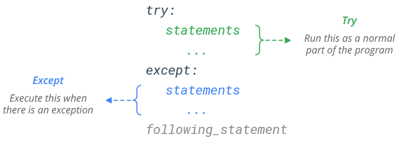

# Errors and Exceptions

## Table of Contents
- [What is Exception Handling in Python?](#what-is-exception-handling-in-python)
- [The `try`/`except` Block](#the-tryexcept-block)
- [Raising an Error](#raising-an-error)

---

## What is Exception Handling in Python?

Managing errors will allow us to **prevent our program from abruptly stopping** and will give us the ability to **display a customized error to the user instead of the classic interpreter errors**.

### Classic Python Interpreter Error
```python
print(10/0)
```
**Console:**
```python
Traceback (most recent call last):
  File "<stdin>", line 1, in <module>
ZeroDivisionError: division by zero
```
### Customized Error

```python
try:
    print(10/0)
    
except ZeroDivisionError:
    print("You can't divide by zero!")
```
**Console:**
```console
You can't divide by zero!
```

---

## The `try`/`except` Block
By using `try`/`except`, we can establish a condition to handle errors within the `try` block. If an error occurs, the code within the `except` block is executed. If no error occurs, the code runs normally.

#### Example:
```python
try:
    # Example: Trying to add a text string with a number
    result = "3" + 5
    
except TypeError:
    print("You can't add a string with a number!")
```
**Console:**
```console
You can't add a string with a number!
```

### `except`
We can have a general `except` for any error or multiple `except` blocks for specific errors, allowing us to anticipate and handle each error uniquely.



### `except` for a Specific Error
Let's catch a particular error, for example the error that occurs when accessing an index outside the range of a list. First, let's look at the error that appears in the compiler when doing so:

```python
# Example: Accessing an index outside the range of a list
#Index:  0      1      2
list = ["Hi", "Bye", False]
item = list[5]
```
**Console:**
```console
Traceback (most recent call last):
  File "<stdin>", line 3, in <module>
IndexError: list index out of range
```
The **traceback provides information about the error**, indicating where it occurred, helping us understand and fix the issue.

It tells us that we are trying to access an element in the list that is **out of range**, since our list has only indices 0, 1 and 2, and we are **telling it to access the element at index 5, which does not exist**.

The type of error it gives is `IndexError`, now a **specific except will be used for that type of error**, and **another except block** at the end **for any other error that may occur**.

```python
try:
    #Index:  0      1      2
    list = ["Hi", "Bye", False]
    item = list[5]

except IndexError: #Except for the specific error IndexError
    print("You are trying to access a list index that is out of range")
except: #Except for any other error
    print("An error has occurred")
```
**Console:**
```console
You are trying to access a list index that is out of range
```

### `except` for Any Error
If we use `except` **without adding anything else below**, it means that this except will be applied to **any error that occurs during the execution of the program**.
```python
try:
    n1 = int(input("Enter an integer: "))
    n2 = int(input("Enter another integer: "))
    
    div = n1/n2
    print(f"{n1}/{n2} = {div}")
    
except: #Except for any error
    print("An error has occurred")
```
What is the problem? In the previous example there **can be two types of errors**:
- **A value that cannot be converted to an integer**, for example a letter, is entered in `n1` or `n2`.

**Console:**
```console
Enter an integer: 32
Enter another integer: hola
An error has occurred
```
- The number **0 is entered in `n2`**, which would not give an error when converting it to int, but will give an error when doing the division since it cannot be multiplied by 0.

**Console:**
```console
Enter an integer: 24
Enter another integer: 0
An error has occurred
```
If we put a general except it will warn us that there is an error, but we will not know what is failing. To make our program more efficient, **it would be best to add a specific error type to be able to differentiate between the errors that may occur**.

```python
try:
    n1 = int(input("Enter an integer: "))
    n2 = int(input("Enter another integer: "))
    
    div = n1/n2
    print(f"{n1}/{n2} = {div}")
    
except ZeroDivisionError: #Except for when the value of n2 is 0
    print("You are trying to divide by zero")
except ValueError: #Except when a value that cannot be converted to int is entered into n1 or n2
    print("You have entered a value that cannot be converted to an integer")
except: #Except for any other error
    print("An error has occurred")
```
- Now when a value that cannot be converted to int is entered into `n1` or `n2`:

**Console:**
```console
Enter an integer: 32
Enter another integer: hola
You have entered a value that cannot be converted to an integer:
```
- When the value of `n2` is 0:

**Console:**
```console
Enter an integer: 24
Enter another integer: 0
You are trying to divide by zero
```
- When there is no error:

**Console:**
```console
Enter an integer: 40
Enter another integer: 10
40/10 = 4.0
```

### `finally`
The `finally` block allows us to execute code regardless of whether an error occurred or not. It is not necessary to have an `except` block if we have a `finally`.


In the following example we are going to try to access a key in a dictionary that does not exist, which will give us a `KeyError` type error, the `finally` will be executed after the `except`.
```python
try:
    # Example: Trying to access a non-existent key in a dictionary
    dictionary = {'name': 'John', 'age': 30}
    value = dictionary['height']
except KeyError:
    print("You are trying to access a non-existent key in a dictionary!")
finally:
    print("This will execute no matter what")
```
**Console:**
```console
You are trying to access a non-existent key in a dictionary!
This will execute no matter what.
```

**The `finally` is always executed**, no matter if an error has occurred or not, now in the example below no error occurs since we are accessing a key that does exist in the dictionary, the finally is executed anyway.
```python
try:
    # Example: Trying to access a existent key in a dictionary
    dictionary = {'name': 'John', 'age': 30}
    value = dictionary['age']
except KeyError:
    print("You are trying to access a non-existent key in a dictionary!")
finally:
    print("This will execute no matter what")
```
**Console:**
```console
30
This will execute no matter what
```
---

## Raising an Error
Sometimes we need to manually trigger an error using the `raise` keyword. This allows us to create custom errors and handle them with `except`.
```python
def check_letter(word):
    if 'ñ' in word:
        raise ValueError("Word contains forbidden character: ñ")
    return word

try:
    check_letter("niño")
except ValueError as e:
    print(f"Error: {e}")
```
**Console:**
```console
Error: Word contains forbidden character: ñ
```

In this example, a `ValueError` is raised if the word contains the character 'ñ', and the error is handled by the `except` block.