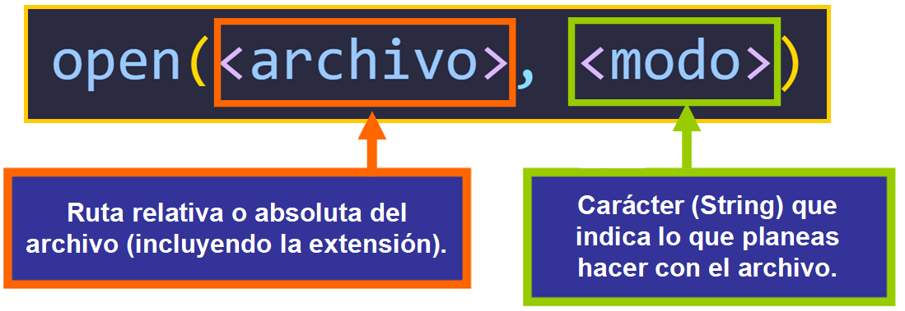
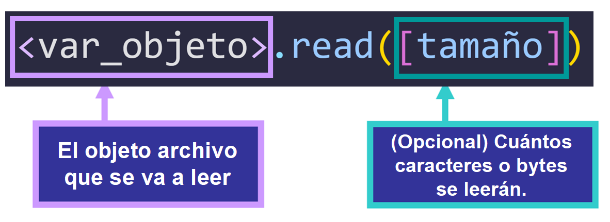

# Working with Files

## Table of Contents
- [Introduction](#introduction)
- [Creating Files in Python Using `open()`](#creating-files-in-python-using-open)
- [File Opening Methods](#file-opening-methods)
- [File Object Methods in Python](#file-object-methods-in-python)
- [Reading Methods](#reading-methods)
- [Writing Methods](#reading-methods)
- [Method `close()`](#reading-methods)


---

## Introduction

We will see how to create and edit files in Python from our code safely using try/except so that in case of errors, we can handle them properly.

---

## Creating Files in Python Using `open()`

The `open()` function accepts the path of the file to be created and the second argument is the mode in which the file will be opened if it exists, where `w` indicates that it is for writing and `r` that it will be read-only.

We can manipulate a variable as a file object by assigning it a file using the built-in `open()` function and specifying its path followed by the mode in which we will open it. Then the variable takes the file as its value and becomes a file object allowing us to work with it using methods.



There are two ways to use `open()`:

- This uses a `with` statement, which ensures that the file is automatically closed when exiting the block of code, even if an error occurs. This is safer and prevents resource leaks. **The code inside the block must be indented**.

```python
with open('book.txt', 'r') as file:
    #The code inside the block is indented
```
- This opens the file, but it does not guarantee that the file will be closed automatically. You need to close the file manually using `file.close()`. If you forget to do this, it can lead to resource leaks or corrupted files.
```python
file = open('book.txt', 'r')
#It is not a block of code, the file is opened inside the variable called file and therefore the following lines are not indented.
```

---

## File Opening Methods

| Method        | Syntax  | Description |
|---------------|---------|-------------|
| Read Only Mode (Read)  | `r`  | To specify that we open it in read mode. It only allows the interpreter to work with it in read mode so it will load it into memory but cannot edit it. |
| Write Mode    | `w`  | When opening a file in this mode, it will be erased and rewritten. If the file does not exist, it will be created. But keep in mind that if it exists, it will be overwritten. |
| Append Mode (Write at the end)  | `a`  | Allows us to write to the file at the end of it. If we open a file using this mode, we will always be writing at the end of what is already in it. If the file does not exist, it will be created. |
| Read-Write Mode (+)  | `r+` `w+`  | If we add a `+` to any of the above, it becomes read and write mode. But both (`r+`) and (`w+`) work differently. When using (`w+`), if the file exists, all its content will be erased and overwritten. This is not the case with (`r+`). |

---

## File Object Methods in Python

A method can be a series of statements to carry out an action but in this case, we can see the method as the request to an object to perform a task or, in this case, a change.

To better understand this, an object would be our dog, and the methods are the commands we give to our dog to do things (sit, lie down, paw, etc.).

---

## Reading Methods
### Method `read()`

The `read()` method allows us to read a complete file unless we specify the bytes, in which case it will only read up to the specified bytes.



#### Example
**book.txt**
```txt
It was the best of times, it was the worst of times, it was the age of wisdom, it was the age of foolishness,
it was the epoch of belief, it was the epoch of incredulity, it was the season of Light, it was the season of Darkness,
it was the spring of hope, it was the winter of despair.
```
```python
with open('book.txt', 'r') as file:
    content = file.read()
    print(content)
```
**Console**
```console
It was the best of times, it was the worst of times, it was the age of wisdom, it was the age of foolishness,
it was the epoch of belief, it was the epoch of incredulity, it was the season of Light, it was the season of Darkness,
it was the spring of hope, it was the winter of despair.
```

If we do not want to read the entire text and simply want a certain number of characters, we specify it as an argument to the `read()` method.

#### Example
```python
with open('book.txt', 'r') as file:
    content = file.read(100)  # Reads the first 100 characters
    print(content)
```
**Console**
```console
It was the best of times, it was the worst of times, it was the age of wisdom, it was the age of foo
```

### Method `readline()`
The `readline()` method reads one line at a time. If we place only one `readline()`, **it will read one line**. If we do not specify where to start reading, **it will start from the first line by default**.

#### Example
```python
with open('book.txt', 'r') as file:
    first_line = file.readline()
    print(first_line)
```
**Console**
```console
It was the best of times, it was the worst of times, it was the age of wisdom, it was the age of foolishness,
```

### Method `readlines()`
The `readlines()` method **reads all lines in the form of a list**, separating the lines with the newline escape character `\n`.

#### Example
```python
with open('book.txt', 'r') as file:
    all_lines = file.readlines()
    print(all_lines)
```
**Console**
```console
['It was the best of times, it was the worst of times, it was the age of wisdom, it was the age of foolishness,\n', 'it was the epoch of belief, it was the epoch of incredulity, it was the season of Light, it was the season of Darkness,\n', 'it was the spring of hope, it was the winter of despair.']
```
---

## Writing Methods
### Method `write()`
The `write()` method is used to write a string to the same file. For this, we must open it in rewrite mode, which is done by adding `r+` in the opening mode. This way, our string will be added at the end.

#### Example
```python
with open('book.txt', 'r+') as file:
    file.write("This is a new line.\n")
```
**book.txt**
```console
This is a new line.
imes, it was the worst of times, it was the age of wisdom, it was the age of foolishness,
it was the epoch of belief, it was the epoch of incredulity, it was the season of Light, it was the season of Darkness,
it was the spring of hope, it was the winter of despair.
```

**Note**: If you do not use `file.read()`, the line **will be added at the beginning and not at the end**. To add it at the end, you can also open it in append mode `a` instead of `r+` and **without including** `file.read()`. Like this:

#### Example
```python
with open('book.txt', 'a') as file:
    file.write("\nThis is a new line.\n")
```
**book.txt**
```console
It was the best of times, it was the worst of times, it was the age of wisdom, it was the age of foolishness,
it was the epoch of belief, it was the epoch of incredulity, it was the season of Light, it was the season of Darkness,
it was the spring of hope, it was the winter of despair.
This is a new line.
```
### Method `writelines()`
The `writelines()` method allows us to write a sequence (iterable element) line by line, for example: a list.

#### Example
```python
lines = ["First line\n", "Second line\n", "Third line\n"]
with open('book.txt', 'w') as file:
    file.writelines(lines)
```
**book.txt**
```console
First line
Second line
Third line
```
**Note**: Since I opened the file in write mode `w`, what was previously in `book.txt` **has been overwritten**, and now only the new lines are written.

## Method `close()`
The `close()` method is responsible for **closing the file safely**.

#### Example
```python
file = open('book.txt', 'r')
content = file.read()
print(content)
file.close()
```
**book.txt**
```console
It was the best of times, it was the worst of times, it was the age of wisdom, it was the age of foolishness,
it was the epoch of belief, it was the epoch of incredulity, it was the season of Light, it was the season of Darkness,
it was the spring of hope, it was the winter of despair.
```

**If you intend to modify a file after using the** `close()` **method**, **an error will occur** because it is already closed. You will need to open it again.

#### Example
```python
lines = ["First line\n", "Second line\n", "Third line\n"]
file = open('book.txt', 'r+') #Open using rewrite (r+)
content = file.read() #We use read to read the content
file.close()

file.writelines(lines) #We write the list to the file line by line
```
**Console**
```console
Traceback (most recent call last):
  File "<stdin>", line 6, in <module>
    file.writelines(lines) #We write the list to the file line by line
ValueError: I/O operation on closed file.
```