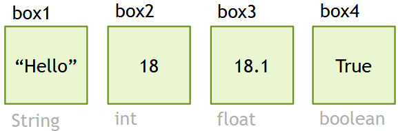
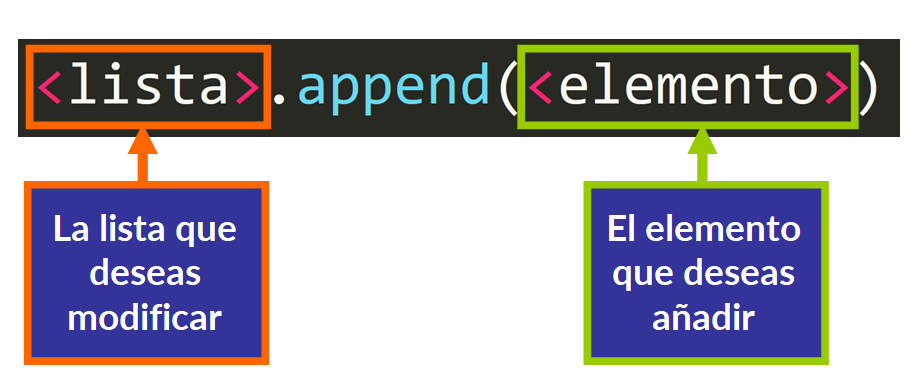
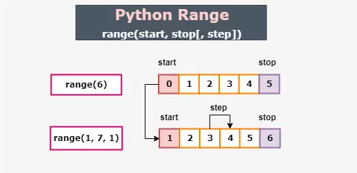

# Tipos de variables, lista, tupla y rango

## Tabla de Contenidos
- [Tipos de variables](#tipos-de-variables)
- [Lista](#lista)
- [Métodos de lista](#métodos-de-lista)
- [Tupla](#tupla)
- [Rango](#rango)

---

## Tipos de variables
### Descripción
Una variable es un espacio en un sistema de almacenamiento que recibe un **identificador** y contiene información que puede ser conocida o desconocida. En otras palabras, una variable puede verse como una caja donde almacenamos e intercambiamos datos de tipos específicos.


### Declaración de Variables
En Python, al declarar una variable, no necesitamos especificar el tipo de datos que vamos a almacenar en ella, a diferencia de otros lenguajes de programación.
#### Ejemplos:
```python
box1 = "Hello"
box2 = 18
box3 = 18.1
box4 = True
```


Como vemos en el código, primero se escribe el nombre de la variable, seguido del operador `=` (que en estos casos es un operador de asignación, no un signo de igualdad), y luego los datos que almacenará. Dependiendo de los datos que almacenemos en ella, Python determinará el tipo de la variable.

### Sintaxis
**Si los datos a almacenar son una `cadena de texto`, recuerda que deben ir entre comillas.**

Siempre debes indicar primero el nombre de la variable y luego su contenido, así:
```python
num = 17
```
Los nombres de las variables son secuencias de letras y números, ya sean mayúsculas o minúsculas, pero **siempre deben comenzar con una letra**. Una variable **nunca debe contener espacios**; para separar palabras, podemos usar un guion bajo `_`.

### Tipos de variables
Hay 3 tipos más comunes de variables:

- **Numéricas:** Almacenan números; dentro de esta categoría, podemos encontrar subtipos como `int`, `float`, `long` y `complex`.
- **Texto:** Son las clásicas variables que almacenan cadenas de texto como `string` y `char`.
- **Booleanas:** Almacenan un valor de True o False como `bool`.

Pero en Python, las variables también pueden ser *listas*, *diccionarios*, *tuplas* (que veremos más adelante). Casi cualquier cosa puede ser almacenada en ellas.

### Función `type()`
Puedes determinar el tipo de una variable utilizando la función integrada `type()`, que permite conocer el tipo de una variable en un momento específico.
Para llamar a la función `type()` simplemente escribimos la función y le pasamos el nombre de la variable como argumento dentro de los paréntesís, así:
```python
box1 = "Hello"
type(box1)
```
**Consola:**
```console
<class 'str'>
```
Al ejecutar el programa, devolverá el tipo de la variable.
```python
box1 = "Hello"
box2 = 18
box3 = 18.1
box4 = True

print(type(box1))
print(type(box2))
print(type(box3))
print(type(box4))
```
**Consola:**
```console
<class 'str'>
<class 'int'>
<class 'float'>
<class 'bool'>
```
---
## Lista
Podemos definir una lista como un área de almacenamiento contigua donde podemos almacenar múltiples y diferentes tipos de datos. **Puede ser editada y modificada** utilizando métodos, lo que la hace mutable.

Para crear una lista, simplemente la declaramos como lo haríamos con una variable, pero almacenando sus elementos o ítems dentro de **corchetes**:
```python
# List of numbers
numbers = [1,2,3,4,5,6,7,8,9]
#List of boolean
responses = [False, True, True, False, False]
#List of mixed values
data = ["Close", 53, 78.102, "Batoi", False]
```

Las listas también pueden crearse sin especificar los elementos que contienen, ya que son mutables y podemos añadir elementos posteriormente.

**Las listas también pueden contener otras listas.**
```python
#List inside other list
data = ["Close", 53, [45, "Python", True], "Batoi", False]
```

### Acceso a Elementos de la Lista
Para acceder a los elementos, debemos considerar que cada elemento almacenado en una lista recibe un `índice`.

Un índice es un número que identifica el elemento dentro del grupo de elementos o ítems, **siempre comenzando desde cero**.

Incluso si modificamos los elementos, el primero siempre será cero, y los índices incrementarán desde ahí.
```python
# Index   0     1    2      3      4
items = ["Hi", 54, False, 37.21, "Table"]
```

Así que, si simplemente quiero acceder al número 37.21 de la lista *items*, debo especificar **la lista seguida del número de índice entre corchetes** que le corresponde.
```python
# Index   0     1    2      3      4
items = ["Hi", 54, False, 37.21, "Table"]
print(items[3])
```
**Consola:**
```console
37.21
```

Para acceder a un elemento en una lista que está dentro de otra lista, primero debes especificar el índice de la lista exterior y luego el índice de la lista interior. En el ejemplo, la lista `[45, "Python", True]` tiene el índice **2** en la lista exterior, y dentro de esta lista, el número 45 tiene el índice **0**.
```python
# Index    0      1          2                3      4
# Index                0     1        2
data = ["Close", 53, [45, "Python", True], "Batoi", False]
print(data[2][0])
```
**Consola:**
```console
45
```
---

## Métodos de lista

### El método `append()`
Se utiliza para **añadir un elemento al final de una lista**. Es muy sencillo de usar: solo escribe el nombre de la lista que deseas modificar, seguido de un punto, el método (append en este caso) y luego el elemento a añadir dentro de paréntesis.



#### Ejemplo:
```python
names1 = ["Marcos", "Roberto", "Elena", "Margarita"]
print(names1)
names1.append("Alex")
print(names1)
```
**Consola:**
```console
["Marcos", "Roberto", "Elena", "Margarita"]
["Marcos", "Roberto", "Elena", "Margarita", "Alex"]
```

### El método `extend()`
Es útil para **añadir múltiples elementos** de un iterable **al final de una lista** o para añadir otra lista en Python. El método `extend()` nos permite extender la lista.

#### Ejemplo 1:
```python
names1 = ["Marcos", "Roberto", "Elena", "Margarita"]
print(names1)
names1.extend("Jose")
print(names1)
```
**Consola:**
```console
["Marcos", "Roberto", "Elena", "Margarita"]
["Marcos", "Roberto", "Elena", "Margarita", "J","o","s","e"]
```

#### Ejemplo 2:
```python
mylist = [1, 2, 3, 4]
mylist.extend([5, 6, 7])
print(mylist)
```
**Consola:**
```console
[1, 2, 3, 4, 5, 6, 7]
```
### El método `insert()`
¿Qué pasa si quiero añadir un elemento en un lugar que no sea al final de la lista?

Para insertar un elemento en una posición específica, podemos usar el método `insert()` de la misma manera que antes. Primero, especifica el nombre de la lista, seguido de un punto y el método (insert en este caso). Luego, **dentro de los paréntesis, proporciona el índice donde deseas insertar el elemento, seguido de una coma y el propio elemento**.


#### Ejemplo:
```python
items = ["Chair", "Table", "Dish", "Glass"]
print(items)
items.insert(2, "Fork")
print(items)
```
**Consola:**
```console
["Chair", "Table", "Dish", "Glass"]
["Chair", "Table", "Fork", "Dish", "Glass"]
```
### El método `pop()`
Se utiliza para **eliminar un elemento de la lista especificando el índice** del elemento. Al igual que los otros métodos, solo necesitas ingresar el nombre de la lista, seguido de un punto y el nombre del método (`pop()` en este caso). Luego, dentro de los paréntesis, especifica el índice del elemento a eliminar.

#### Ejemplo 1:
```python
items = [3.5, 113, "Table", 87.3, 654]
print(items)
items.pop(2)
print(items)
```
**Consola:**
```console
[3.5, 113, "Table", 87.3, 654]
[3.5, 113, 87.3, 654]
```
En este caso, se elimina 'Table', que está en el índice 2 según lo especificado en los paréntesis. **Si no proporcionas un índice al método pop, eliminará el último elemento de la lista.**

Cuando hay una lista dentro de otra y queremos eliminar un elemento de la lista interna, **primero debemos indicar el índice de la tabla interna en la externa**, en el ejemplo la lista interna está en el índice 3 de la lista externa. Luego **aplica el método e indica el índice del elemento que deseas eliminar**, en el ejemplo a continuación la cadena "House" tiene el índice 2.

#### Ejemplo 2:
```python
#Index    0      1      2               3             4
#Index                        0     1      2     3
items = [True, "Yes", 4.23, [0.48,False,"House",47], 654]
print(items)
items[3].pop(2)
print(items)
```
**Consola:**
```console
[True, "Yes", 4.23, [0.48,False,"House",47], 654]
[True, "Yes", 4.23, [0.48,False,47], 654]
```

### El método `remove()`
Este método también puede ser utilizado para eliminar un elemento de la lista. El método `remove()` nos permite eliminar un elemento de una lista en Python **especificando su valor**.

#### Ejemplo 1:
```python
items = [3.5, 113, "Table", 87.3, 654]
print(items)
items.remove("Table")
print(items)
```
**Consola:**
```console
[3.5, 113, "Table", 87.3, 654]
[3.5, 113, 87.3, 654]
```
Cuando hay una lista dentro de otra y queremos eliminar un elemento de la lista interna, **primero debemos indicar el índice de la tabla interna en la externa**, en el ejemplo la lista interna está en el índice 3 de la lista externa. Luego aplica el método e indica el elemento que deseas eliminar, en el ejemplo a continuación es 0.48.

#### Ejemplo 2:
```python
#Index    0      1      2               3             4
#Index                        0     1      2     3
items = [True, "Yes", 4.23, [0.48,False,"House",47], 654]
print(items)
items[3].remove(0.48)
print(items)
```
**Consola:**
```console
[True, "Yes", 4.23, [0.48,False,"House",47], 654]
[True, "Yes", 4.23, [False,"House",47], 654]
```

### El método `sort()`
El método `sort()` nos ayudará a **ordenar los elementos de una lista** de menor a mayor.

#### Ejemplo 1:
```python
grades = [7.8,5.3,3.2,9.9,6.6,2.5]
grades.sort()
print(grades)
```
**Consola:**
```console
[2.5, 3.2, 5.3, 6.6, 7.8, 9.9]
```

Si queremos que el método sort ordene los elementos **de mayor a menor**, debemos ingresar el argumento `reverse=True`.

#### Ejemplo 2:
```python
grades = [7.8,5.3,3.2,9.9,6.6,2.5]
grades.sort(reverse=True)
print(grades)
```
**Consola:**
```console
[9.9, 7.8, 6.6, 5.3, 3.2, 2.5]
```
### El método `reverse()`
El método `reverse()` nos ayudará a **invertir todos los elementos de una lista**, como si los viéramos a través de un espejo.

#### Ejemplo:
```python
letters = ["i","o","t","a","B"]
letters.reverse()
print(letters)
```
**Consola:**
```console
["B", "a", "t", "o", "i"]
```

### El método `split()`
El método `split()` se usa con `string`, no con `list`. Divide una cadena de texto en partes más pequeñas usando un carácter específico o una secuencia de caracteres como delimitador y devuelve esas partes en una lista.
#### Sintaxis
```python
string.split(separator)
```
- **string:** la cadena de texto que desea dividir.
- **separador:** el carácter o la secuencia de caracteres utilizados como delimitador.

#### Ejemplo 1:
```python
text = "Hello, how are you?"
text_divided = text.split(",")
print(text_divided)
```
**Consola:**
```console
["Hello","how are you?"]
```

#### Ejemplo 2:
***Nota:*** De forma predeterminada, si no se especifica ningún separador, la cadena se divide por espacios en blanco.
```python
text = "Hello, how are you?"
text_divided = text.split()
print(text_divided)
```
**Consola:**
```console
["Hello,","how","are","you?"]
```
---
## Tupla
Una tupla es similar a una lista en el sentido de que es un área de almacenamiento contigua donde podemos almacenar múltiples y diferentes elementos. Sin embargo, existen algunas similitudes y diferencias distintas que debes recordar siempre.

Las tuplas son variables donde se almacenan diferentes tipos de datos estructurados y deben estar ordenadas desde el principio.

**Las tuplas son inmutables**; no **pueden ser modificadas** durante la ejecución del programa. Por lo tanto, al crear una tupla, debes incluir los elementos a almacenar. Siempre que creemos una tupla, ***debemos usar PARÉNTESIS***.
```python
# Tuple of numbers
numbers = (1, 579.24, 3.6, 4, 5, 6, 7)
#Tuple of boolean
responses = (False, True, True, False, False)
#List of mixed values
data = ("Close", 53, 78.102, "Batoi", False)
```
### Acceso a Elementos de la Tupla
Para acceder a los elementos, debemos considerar que cada elemento almacenado en una tupla recibe un `index` (índice).

Un índice es un número que identifica el elemento dentro del grupo de elementos o ítems, **siempre comenzando desde cero**.

Incluso si modificamos los elementos, el primero siempre será cero y los índices se incrementarán a partir de ahí.
```python
# Index   0     1     2      3      4
items = (183, True, "ABC", 59.20, "End")
```

Para acceder a los valores de una tupla, se hace exactamente de la misma manera que en una lista, usando **corchetes** ***(NO PARÉNTESIS)***. Así que, si simplemente quiero acceder a la cadena "ABC" de la tupla *items*, debo especificar **la tupla seguida del número de índice entre corchetes** que le corresponde:
```python
# Index   0     1     2      3      4
items = (183, True, "ABC", 59.20, "End")
print(items[2])
```
**Consola:**
```console
ABC
```
---
## Diferencia Entre Listas y Tuplas
| Lista      | Tupla      |
|---------------|---------------|
| Se pueden modificar, son dinámicas  | No se pueden modificar, son estáticas |
| Usan corchetes `[]`  | Usan paréntesis `()` |
| Los elementos se separan con comas   | Los elementos se separan con comas |
| list = [1, 2, 3]| tuple = (1, 2, 3)   |
| Acceso a elementos: list[indice] | Acceso a elementos: tuple[indice] |

---
## Rango
Crea un rango de valores según lo especificado por tus argumentos. Especifica **dónde comenzar** a seleccionar, **dónde terminar**, y los **intervalos**.
It cannot be modified except at the time of creation, or after instructing the interpreter to store it in a variable.



Si ejecutas, por ejemplo, `range(5)`, no notarás nada sucediendo, pero algo sí pasó: una secuencia de números como especificaste se almacena en la memoria. Sin embargo, sigue siendo invisible porque no existe como un objeto que puedas ver. Para poder verlo, primero debemos convertirlo en una lista. Para hacer esto, utilizamos la función `list()`.
#### Ejemplo 1:
```python
x = list(range(5))
print(x)
```
**Consola:**
```console
[0,1,2,3,4]
```

#### Ejemplo 2:
Vamos a crear un rango que almacene en una lista todos los números pares entre el 2 y el 20:
```python
x = list(range(2,20,2))
print(x)
```
**Consola:**
```console
[2, 4, 6, 8, 10, 12, 14, 16, 18]
```