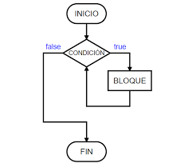

# Bucles For y While

## Tabla de Contenidos
- [Bucles en Python](#bucles-en-python)
- [Bucle `for`](#bucle-for)
- [Bucle `while`](#bucle-while)
- [Control de Bucles: `break`, `continue` y `pass`](#control-de-bucles-break-continue-y-pass)
- [Diferencias entre `for` y `while`](#diferencias-entre-for-y-while)

---

## Bucles en Python

Un bucle en programación **es la ejecución continua de un bloque específico de código mientras se cumpla una condición designada**.
Por ejemplo, un bucle es una parte de nuestro programa que se ejecuta continuamente **mientras se cumpla una cierta condición**.



---

## Bucle `for`

- El bucle `for` se encarga de **iterar sobre una secuencia**, buscando elementos que cumplan con una cierta condición, y realizando alguna instrucción según se indique. Es importante notar que estos elementos deben ser **iterables**, es decir, **pueden ser recorridos**.

- En el caso de un bucle `for`, se debe especificar la variable donde se **almacenarán los elementos** del elemento iterable (`lista`, `diccionario`, `cadena`, etc.).

- La sentencia `for` **es seguida por la variable donde se almacenarán los elementos**, luego el operador **`in`** y **el elemento a iterar**.

```python
numbers = [1, 2, 3, 4, 5, 6, 7, 8, 9]  # Create the list with numbers

for num in numbers:  # Store the list items in the variable "num"
    if num % 2 == 0:  # Condition: If the remainder of the division by two is zero, then:
        print(num)  # Print the variable num
```
**Consola:**
```console
2
4
6
8
```

## Bucle `while`
- El bucle `while` nos permite **ejecutar un bloque de código continuamente *mientras la condición sea verdadera***, e incluso podemos crear bucles infinitos.

- Estos bucles se ejecutan mientras la condición sea verdadera; si se cumple, se ejecuta el cuerpo del bucle, y luego se verifica nuevamente la condición. Si sigue siendo verdadera, el bucle se ejecuta nuevamente. Si no se cumple, se omite el bucle y el programa continúa normalmente.

```python
i = 0  # Declare the value of the variable "i"

while i <= 9:  # Create the loop with the condition to execute while "i" is less than or equal to "9"
    i += 1  # Increment i by one (i is equal to i plus one)
    print(i)  # Print "i"
```
**Consola:**
```console
1
2
3
4
5
6
7
8
9
10
```

## Control de Bucles: `break`, `continue` y `pass`
A veces no queremos que un bucle continúe indefinidamente una vez que haya cumplido su propósito. Para ello, tenemos el control de bucles mediante estas tres instrucciones: `break`, `continue` y `pass`.

### `break`
Esta instrucción se utiliza para **terminar un bucle**, es decir, salir de él y continuar con la ejecución de las instrucciones restantes del programa.

```python
string = "Python"

for letter in string:
    if letter == "h":
        print("Found the 'h'")
        break
    print(letter)
```
**Consola:**
```console
P
y
t
Found the 'h'
```
```python
x = 5

while True:
    x -= 1
    print(x)
    if x == 0:
        break
print("End of the loop")

```
**Consola:**
```console
4
3
2
1
0
End of the loop
```
### `continue`
La instrucción `continue` dentro de un bucle **obliga al intérprete a volver al comienzo del bucle**, saltándose todas las instrucciones o iteraciones que estén por debajo.

```python
string = "Python"

for letter in string:
    if letter == "P":
        continue
    print(letter)
```
**Consola:**
```console
y
t
h
o
n
```
```python
x = 5

while x > 0:
    x -= 1
    if x == 3:
        continue
    print(x)
```
**Consola:**
```console
4
2
1
0
```

### `pass`
La instrucción `pass` **es una declaración nula; no hace nada**. Es casi como si no existiera, pero nos permite crear un bucle sin colocar código en su cuerpo, para añadirlo más tarde, usándolo como un marcador de posición temporal.

La diferencia con `continue` es que `continue` termina la iteración actual pero continúa con la siguiente instrucción o iteración del bucle, volviendo al principio. En cambio, `pass` no hace nada y continúa con las siguientes instrucciones del bucle sin volver al principio.

```python
for letter in "Python":
    if letter == "h":
        pass
    print("Current letter:", letter)
```
**Consola:**
```console
Current letter: P
Current letter: y
Current letter: t
Current letter: h
Current letter: o
Current letter: n
```
```python
var = 10

while var > 0:
    var -= 1
    if var == 5:
        pass
    print("Current value of the variable:", var)
```
**Consola:**
```console
Current value of the variable: 9
Current value of the variable: 8
Current value of the variable: 7
Current value of the variable: 6
Current value of the variable: 5
Current value of the variable: 4
Current value of the variable: 3
Current value of the variable: 2
Current value of the variable: 1
Current value of the variable: 0
```

## Diferencias entre `for` y `while`

- `for`:
    - **Propósito**: Un bucle `for` se utiliza para iterar sobre una secuencia (por ejemplo, lista, tupla, diccionario, conjunto o cadena).
    - **Control de Iteración**: El número de iteraciones está definido por la cantidad de elementos en la secuencia. Itera a través de cada elemento uno por uno.
    - **Caso de Uso**: Mejor para escenarios donde necesitas ejecutar un bloque de código para cada elemento en una secuencia y sabes el número de iteraciones de antemano.

- `while`:
    - **Propósito**: Un bucle `while` se utiliza para repetir un bloque de código mientras una condición sea verdadera.
    - **Control de Iteración**: El número de iteraciones está controlado por una condición, que se evalúa antes de cada iteración. Puede potencialmente llevar a un bucle infinito si la condición nunca se vuelve falsa.
    - **Caso de Uso**: Ideal para escenarios donde no se conoce de antemano el número de iteraciones y depende de que se cumpla una cierta condición durante la ejecución.
