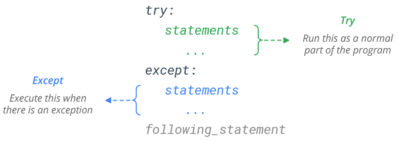

# Errores y Excepciones

## Tabla de Contenidos
- [¿Qué es el Manejo de Excepciones en Python?](#qué-es-el-manejo-de-excepciones-en-python)
- [El Bloque `try`/`except`](#el-bloque-tryexcept)
- [Lanzar un Error](#lanzar-un-error)

---

## ¿Qué es el Manejo de Excepciones en Python?

Gestionar errores nos permitirá **evitar que nuestro programa se detenga abruptamente** y nos dará la capacidad de **mostrar un error personalizado al usuario en lugar de los errores clásicos del intérprete**.

### Error clásico del intérprete de Python
```python
print(10/0)
```
**Consola:**
```python
Traceback (most recent call last):
  File "<stdin>", line 1, in <module>
ZeroDivisionError: division by zero
```
### Error personalizado

```python
try:
    print(10/0)
    
except ZeroDivisionError:
    print("You can't divide by zero!")
```
**Consola:**
```console
You can't divide by zero!
```

---

## El Bloque `try`/`except`
Al usar `try`/`except`, podemos establecer una condición para manejar errores dentro del bloque `try`. Si ocurre un error, se ejecuta el código dentro del bloque `except`. Si no ocurre ningún error, el código se ejecuta normalmente.

#### Ejemplo:
```python
try:
    # Example: Trying to add a text string with a number
    result = "3" + 5
    
except TypeError:
    print("You can't add a string with a number!")
```
**Consola:**
```console
You can't add a string with a number!
```

### `except`
Podemos tener un `except` general para cualquier error o múltiples bloques `except` para errores específicos, lo que nos permite anticipar y manejar cada error de manera única.



### `except` para un Error Específico
Vamos a capturar un error particular, por ejemplo, el error que ocurre al intentar acceder a un índice fuera del rango de una lista. Primero, veamos el error que aparece en el compilador al hacerlo:

```python
# Example: Accessing an index outside the range of a list
#Index:  0      1      2
list = ["Hi", "Bye", False]
item = list[5]
```
**Consola:**
```console
Traceback (most recent call last):
  File "<stdin>", line 3, in <module>
IndexError: list index out of range
```
El **traceback proporciona información sobre el error**, indicando dónde ocurrió, lo que nos ayuda a entender y solucionar el problema.

Indica que estamos intentando acceder a un elemento en la lista que está **fuera del rango**, ya que nuestra lista solo tiene los índices 0, 1 y 2, y estamos **intentando acceder al elemento en el índice 5, que no existe**.

El tipo de error que da es `IndexError`, ahora se **utilizará un except específico para ese tipo de error**, y **otro bloque except** al final **para cualquier otro error que pueda ocurrir**.

```python
try:
    #Index:  0      1      2
    list = ["Hi", "Bye", False]
    item = list[5]

except IndexError: #Except for the specific error IndexError
    print("You are trying to access a list index that is out of range")
except: #Except for any other error
    print("An error has occurred")
```
**Consola:**
```console
You are trying to access a list index that is out of range
```

### `except` para Cualquier Error
Si usamos `except` **sin añadir nada más debajo**, significa que este except se aplicará a **cualquier error que ocurra durante la ejecución del programa**.
```python
try:
    n1 = int(input("Enter an integer: "))
    n2 = int(input("Enter another integer: "))
    
    div = n1/n2
    print(f"{n1}/{n2} = {div}")
    
except: #Except for any error
    print("An error has occurred")
```
¿Cuál es el problema? En el ejemplo anterior **pueden ocurrir dos tipos de errores**:
- **Se ingresa un valor que no se puede convertir a entero**, por ejemplo, una letra, en `n1` o `n2`.

**Consola:**
```console
Enter an integer: 32
Enter another integer: hola
An error has occurred
```
- Se **ingresa el número 0 en `n2`**, lo cual no daría un error al convertirlo a int, pero dará un error al realizar la división, ya que no se puede dividir por 0.

**Consola:**
```console
Enter an integer: 24
Enter another integer: 0
An error has occurred
```
Si ponemos un except general, nos avisará que hay un error, pero no sabremos qué está fallando. Para hacer nuestro programa más eficiente, **lo mejor sería añadir un tipo de error específico para poder diferenciar entre los errores que puedan ocurrir**.

```python
try:
    n1 = int(input("Enter an integer: "))
    n2 = int(input("Enter another integer: "))
    
    div = n1/n2
    print(f"{n1}/{n2} = {div}")
    
except ZeroDivisionError: #Except for when the value of n2 is 0
    print("You are trying to divide by zero")
except ValueError: #Except when a value that cannot be converted to int is entered into n1 or n2
    print("You have entered a value that cannot be converted to an integer")
except: #Except for any other error
    print("An error has occurred")
```
- Ahora, cuando se ingresa un valor que no se puede convertir a int en `n1` o `n2`:

**Consola:**
```console
Enter an integer: 32
Enter another integer: hola
You have entered a value that cannot be converted to an integer:
```
- Cuando el valor de `n2` es 0:

**Consola:**
```console
Enter an integer: 24
Enter another integer: 0
You are trying to divide by zero
```
- Cuando no hay ningún error:

**Consola:**
```console
Enter an integer: 40
Enter another integer: 10
40/10 = 4.0
```

### `finally`
El bloque `finally` nos permite ejecutar código sin importar si ocurrió un error o no. No es necesario tener un bloque `except` si tenemos un `finally`.


En el siguiente ejemplo vamos a intentar acceder a una clave de un diccionario que no existe, lo que nos dará un error de tipo `KeyError`, el `finally` se ejecutará después del `except`.
```python
try:
    # Example: Trying to access a non-existent key in a dictionary
    dictionary = {'name': 'John', 'age': 30}
    value = dictionary['height']
except KeyError:
    print("You are trying to access a non-existent key in a dictionary!")
finally:
    print("This will execute no matter what")
```
**Consola:**
```console
You are trying to access a non-existent key in a dictionary!
This will execute no matter what.
```

**El `finally` siempre se ejecuta**, sin importar si ocurrió un error o no, Ahora bien, en el ejemplo siguiente no se produce ningún error ya que estamos accediendo a una clave que existe en el diccionario; el `finally` se ejecuta de todos modos.
```python
try:
    # Example: Trying to access a existent key in a dictionary
    dictionary = {'name': 'John', 'age': 30}
    value = dictionary['age']
except KeyError:
    print("You are trying to access a non-existent key in a dictionary!")
finally:
    print("This will execute no matter what")
```
**Consola:**
```console
30
This will execute no matter what
```
---

## Lanzar un Error
A veces necesitamos disparar manualmente un error utilizando la palabra clave `raise`. Esto nos permite crear errores personalizados y manejarlos con `except`.
```python
def check_letter(word):
    if 'ñ' in word:
        raise ValueError("Word contains forbidden character: ñ")
    return word

try:
    check_letter("niño")
except ValueError as e:
    print(f"Error: {e}")
```
**Consola:**
```console
Error: Word contains forbidden character: ñ
```

En este ejemplo, se lanza un `ValueError` si la palabra contiene el carácter 'ñ', y el error se maneja con el bloque `except`.