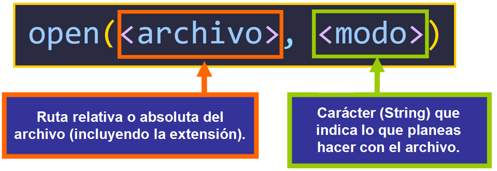

# Trabajo con Archivos

## Tabla de Contenidos
- [Introducción](#introducción)
- [Creación de Archivos en Python Usando `open()`](#creación-de-archivos-en-python-usando-open)
- [Métodos de Apertura de Archivos](#métodos-de-apertura-de-archivos)
- [Métodos de Objetos de Archivo en Python](#métodos-de-objetos-de-archivo-en-python)
- [Métodos de Lectura](#métodos-de-lectura)
- [Métodos de Escritura](#métodos-de-escritura)
- [Método `close()`](#método-close)

---

## Introducción

Veremos cómo crear y editar archivos en Python desde nuestro código de manera segura utilizando try/except, de modo que en caso de errores, podamos manejarlos adecuadamente.

---

## Creación de Archivos en Python Usando `open()`

La función `open()` acepta la ruta del archivo que se va a crear y el segundo argumento es el modo en que se abrirá el archivo si existe, donde `w` indica que es para escribir y `r` que será solo de lectura.

Podemos manipular una variable como un objeto de archivo asignándole un archivo usando la función incorporada `open()` y especificando su ruta seguida del modo en que lo abriremos. Luego, la variable toma el archivo como su valor y se convierte en un objeto de archivo que nos permite trabajar con él usando métodos.



Hay dos formas de utilizar `open()`:

- Utiliza una declaración `with`, que garantiza que el archivo se cierre automáticamente al salir del bloque de código, incluso si ocurre un error. Esto es más seguro y siempre intentaremos hacerlo de esta manera, **el código que vaya dentro del bloque debe llevar indentación**.
```python
with open('book.txt', 'r') as file:
    #The code inside the block is indented
```

- Abre el archivo, pero no garantiza que se cierre automáticamente. Es necesario cerrar el archivo manualmente utilizando `file.close()`. Si se olvida hacerlo, puede haber problemas de fugas de recursos o archivos corruptos.
```python
file = open('book.txt', 'r')
#It is not a block of code, the file is opened inside the variable called file and therefore the following lines are not indented.
```
---

## Métodos de Apertura de Archivos

| Método        | Sintaxis  | Descripción |
|---------------|---------|-------------|
| Modo Solo Lectura (Lectura)  | `r`  | Para especificar que lo abrimos en modo lectura. Solo permite que el intérprete trabaje con él en modo lectura, por lo que lo cargará en memoria pero no podrá editarlo. |
| Modo Escritura    | `w`  | Al abrir un archivo en este modo, se borrará y reescribirá. Si el archivo no existe, se creará. Pero ten en cuenta que si existe, se sobrescribirá. |
| Modo Agregar (Escribir al final)  | `a`  | Nos permite escribir en el archivo al final del mismo. Si abrimos un archivo usando este modo, siempre estaremos escribiendo al final de lo que ya está en él. Si el archivo no existe, se creará. |
| Modo Lectura-Escritura (+)  | `r+` `w+`  | Si añadimos un `+` a cualquiera de los anteriores, se convierte en modo de lectura y escritura. Pero tanto (`r+`) como (`w+`) funcionan de manera diferente. Al usar (`w+`), si el archivo existe, todo su contenido se borrará y sobrescribirá. Esto no ocurre con (`r+`). |

---

## Métodos de Objetos de Archivo en Python

Un método puede ser una serie de declaraciones para llevar a cabo una acción, pero en este caso, podemos ver el método como la solicitud a un objeto para realizar una tarea o, en este caso, un cambio.

Para entender mejor esto, un objeto sería nuestro perro, y los métodos son los comandos que le damos a nuestro perro para hacer cosas (sentarse, acostarse, dar la pata, etc.).

---

## Métodos de Lectura
### Método `read()`

El método `read()` nos permite leer un archivo completo a menos que especifiquemos los bytes, en cuyo caso solo leerá hasta los bytes especificados.


#### Ejemplo
```console title="book.txt"
It was the best of times, it was the worst of times, it was the age of wisdom, it was the age of foolishness,
it was the epoch of belief, it was the epoch of incredulity, it was the season of Light, it was the season of Darkness,
it was the spring of hope, it was the winter of despair.
```
```python
with open('book.txt', 'r') as file:
    content = file.read()
    print(content)
```
**Consola**
```console
It was the best of times, it was the worst of times, it was the age of wisdom, it was the age of foolishness,
it was the epoch of belief, it was the epoch of incredulity, it was the season of Light, it was the season of Darkness,
it was the spring of hope, it was the winter of despair.
```

Si no queremos leer todo el texto y simplemente queremos una cierta cantidad de caracteres, lo especificamos como un argumento para el método `read()`.

#### Ejemplo
```python
with open('book.txt', 'r') as file:
    content = file.read(100)  # Reads the first 100 characters
    print(content)
```
**Consola**
```console
It was the best of times, it was the worst of times, it was the age of wisdom, it was the age of foo
```

### Método `readline()`
El método `readline()` lee una línea a la vez. Si colocamos solo un `readline()`, **leerá una línea**. Si no especificamos dónde empezar a leer, **comenzará desde la primera línea por defecto**.

#### Ejemplo
```python
with open('book.txt', 'r') as file:
    first_line = file.readline()
    print(first_line)
```
**Consola**
```console
It was the best of times, it was the worst of times, it was the age of wisdom, it was the age of foolishness,
```

### Método `readlines()`
El método `readlines()` **lee todas las líneas en forma de lista**, separando las líneas con el carácter de escape de nueva línea `\n`.

#### Ejemplo
```python
with open('book.txt', 'r') as file:
    all_lines = file.readlines()
    print(all_lines)
```
**Consola**
```console
['It was the best of times, it was the worst of times, it was the age of wisdom, it was the age of foolishness,\n', 'it was the epoch of belief, it was the epoch of incredulity, it was the season of Light, it was the season of Darkness,\n', 'it was the spring of hope, it was the winter of despair.']
```
---

## Métodos de Escritura
### Método `write()`
El método `write()` se utiliza para escribir una cadena en el mismo archivo. Para esto, debemos abrirlo en modo de reescritura, lo cual se hace añadiendo `r+` en el modo de apertura. **De esta manera, nuestra cadena se añadirá al final**.

#### Ejemplo
```python
with open('book.txt', 'r+') as file:
    file.write("This is a new line.\n")
```
```console title="book.txt"
This is a new line.
imes, it was the worst of times, it was the age of wisdom, it was the age of foolishness,
it was the epoch of belief, it was the epoch of incredulity, it was the season of Light, it was the season of Darkness,
it was the spring of hope, it was the winter of despair.
```

**Nota**: Si no usas `file.read()`, la línea **se añadirá al principio y no al final**. Para añadirla al final, también puedes abrirlo en modo de agregar a en lugar de `r+` y **sin incluir** `file.read()`. Así:

#### Ejemplo
```python
with open('book.txt', 'a') as file:
    file.write("\nThis is a new line.\n")
```
```console title="book.txt"
It was the best of times, it was the worst of times, it was the age of wisdom, it was the age of foolishness,
it was the epoch of belief, it was the epoch of incredulity, it was the season of Light, it was the season of Darkness,
it was the spring of hope, it was the winter of despair.
This is a new line.
```
### Método `writelines()`
El método `writelines()` nos permite escribir una secuencia (elemento iterable) línea por línea, por ejemplo: una lista.

#### Ejemplo
```python
lines = ["First line\n", "Second line\n", "Third line\n"]
with open('book.txt', 'w') as file:
    file.writelines(lines)
```
```console title="book.txt"
First line
Second line
Third line
```
**Nota**: Dado que abrí el archivo en modo escritura `w`, lo que había previamente en `book.txt` **ha sido sobrescrito**, y ahora solo están escritas las nuevas líneas.

## Método `close()`
El método `close()` se encarga de **cerrar el archivo de manera segura**.

#### Ejemplo
```python
file = open('book.txt', 'r')
content = file.read()
print(content)
file.close()
```
```console title="book.txt"
It was the best of times, it was the worst of times, it was the age of wisdom, it was the age of foolishness,
it was the epoch of belief, it was the epoch of incredulity, it was the season of Light, it was the season of Darkness,
it was the spring of hope, it was the winter of despair.
```
**Si intentas modificar un archivo después de usar el método** `close()`, **ocurrirá un error** porque ya está cerrado. Necesitarás abrirlo de nuevo.

#### Ejemplo
```python
lines = ["First line\n", "Second line\n", "Third line\n"]
file = open('book.txt', 'r+') #Open using rewrite (r+)
content = file.read() #We use read to read the content
file.close()

file.writelines(lines) #We write the list to the file line by line
```
**Consola**
```console
Traceback (most recent call last):
  File "<stdin>", line 6, in <module>
    file.writelines(lines) #We write the list to the file line by line
ValueError: I/O operation on closed file.
```